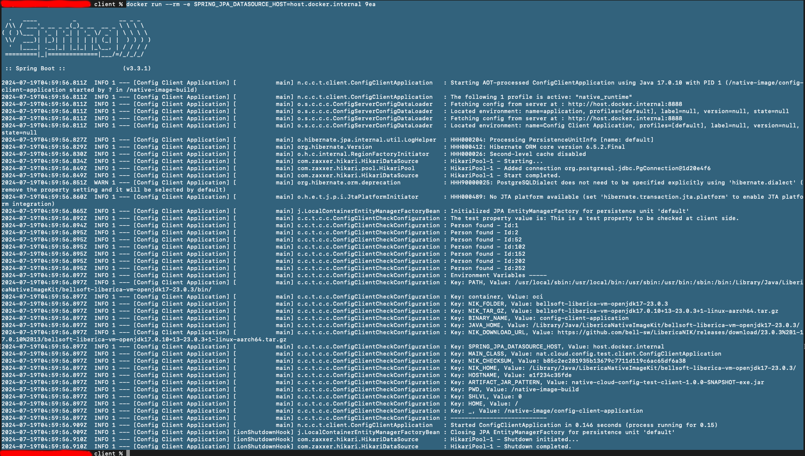

# Native Cloud Config Test Showcase

How to set up this native cloud config test showcase

1. (Config Server) Start ConfigServerApplication (Access can be checked configs via: http://localhost:8888/application/default/yml)
2. (Database) docker pull postgres:latest
3. (Database) docker run --rm --publish 127.0.0.1:5432:5432 -e POSTGRES_DB=test -e POSTGRES_USER=admin -e POSTGRES_PASSWORD=test -d postgres:latest
4. (Config Client) Start ConfigClientApplication
5. (Build) `mvn verify -Pnative_build` if you want to build a native image or `mvn verify` to only package the executable jar without aot.
6. (Native Image) `cd client`
7. (Native Image) run command `docker build -t testimg .`
8. (Native Image) run command `docker images` to find the image id
9. (Native Image) run command `docker run --rm -e SPRING_JPA_DATASOURCE_HOST=host.docker.internal -e SPRING_PROFILES_ACTIVE=native_build,runtime <image_id>` to run the actual image

## Explanation

As of the documentation https://docs.spring.io/spring-cloud-config/docs/current/reference/html/#_aot_and_native_image_support_2 the config server needs
to be available during the build process. Because we don't want our application to perform actual database requests and the `process-aot` should reach all
beans during the ahead-of-time compilation we define a profile on the config server which uses a h2 in-memory database. Later during runtime spring shows the profile
but loads the default configuration which connects to the postgresql. The export of the SPRING_JPA_DATASOURCE_HOST is only required so that the container is able
to connect to the host.

